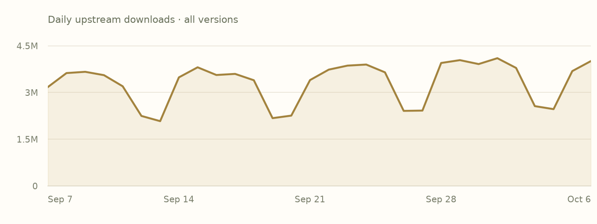
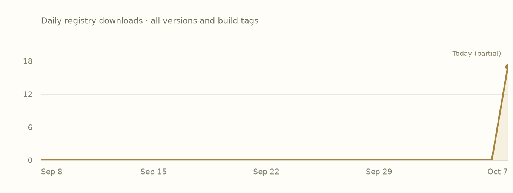

# Deterministic package pages

Design/data contract for the playground, October 7, 2026. This document records what a website renderer should consume; it does not implement a renderer or enable a workflow. No LLM is required at collection, rendering or serving time.

## Page content and its source

| Page content | Source | Rendering rule |
| --- | --- | --- |
| Scoped identity, available versions, yank state, facets | Pinned index and admitted events | Use full registry/scoped identity in routes, data keys and relations. Never treat a bare name as identity. |
| Description, license, repository, homepage, documentation links | Adoption event `about` metadata; native publisher metadata when supported | Render recorded values. Missing stays missing. Index lines currently do not carry the adoption `about` object. |
| Overview, code examples and feature explanations | README/documentation shipped in the digest-verified source archive or publisher documentation asset | Render author-provided material. No generated package summaries, invented examples or inferred feature purposes. |
| Authors | Adopted package archive's declared Cargo authors; corresponding native publisher-supplied metadata when defined | Separate source authors, upstream uploader, adoption actor and scope owners. The current adoption `About` model does not preserve authors. |
| Feature names and activation edges | Manifest/index feature declarations | Show exact names and deterministic effect statements: enables a feature, activates an optional dependency, forwards a dependency feature, or conditionally forwards to an already-enabled dependency. |
| Default feature state and activation paths | Feature expansion over recorded declarations | Use transitive expansion and correct weak/optional forwarding. Reuse registry/Oven logic; direct membership in `default` is insufficient. An empty edge list does not mean the feature has no effect on source code. |
| Declared dependencies | Index/manifest dependency records, including target expressions and feature requests | Requirements are not resolved versions. Do not mark a target-specific declaration universally active. |
| Resolved dependency graph | An actual recorded resolution for roots, target, host and requested features | Name that selection. A declaration preview is not a resolved project graph. Missing selections are not fabricated. |
| Dependents | Reverse edges over a pinned index | Distinguish declared/conditional relations from active relations in a recorded resolution. State checkpoint, version policy and coverage. |
| Indexed builds and attestations | Bound facts and asset manifests | Show the exact target/toolchain/profile/feature binding and evidence status. Absence of an indexed Windows build does not imply upstream Windows incompatibility. |
| Release/adoption chronology | Publication/adoption events; cached upstream version metadata for upstream dates | Keep upstream releases and Incan availability separate. Never imply every upstream version is adopted. |
| Release notes | Shipped changelog or a cached, matching publisher release note | If absent, show a source link or unavailable state. Do not generate release prose from version differences. |
| Popularity graphs | Validated dated statistics snapshots and daily history | Render charts from real daily values. Label source, window, freshness and partial days. Keep upstream and Incan registry counts separate. |
| Security | Recorded advisories/yanks plus any explicitly collected advisory snapshot | Report coverage and source. Zero registry advisories is not proof of zero upstream vulnerabilities. |
| Report abuse | Deliberately configured registry reporting destination | Never invent an inbox. Keep confidential vulnerability reporting distinct. |

Template explanations are deterministic UI text, not generated package descriptions. For example: `logging -> dep:log` yields “Activates optional dependency log”; `memchr?/logging` yields “Enables memchr/logging if memchr is already enabled”. No performance claims or feature-purpose prose follow from these edges alone.

## Concrete example: memchr

The declared default closure is `default -> std -> alloc`. Therefore alloc is enabled under defaults even though it is not named directly in `default`. `logging -> dep:log` activates an optional dependency. `rustc-dep-of-std -> core -> dep:core` activates the dependency aliased as core, whose full Loaf identity is `crates-io/rustc-std-workspace-core`.

These facts come from recorded declarations. Build availability still comes from an exact matching binding and asset identity.

## Popularity belongs in the vertical metadata sidebar

Retain the small gold chart treatment. Display two separately labeled groups where both sources exist. A full-size chart and daily-value table can remain in the single-page document under a Popularity anchor.

The current regex snapshot, collected October 7, 2026 at 10:29 UTC, contains:

- crates.io: 99,732,053 downloads over 30 complete UTC days, September 7–October 6, across all upstream versions.
- GitHub Packages/Incan registry: 17 all-time downloads across versions and build tags. Its daily history includes October 7 as a partial day. These are pulls, not unique users or project installs.

Data: [saved snapshot](assets/package-context.json), [source provenance](assets/package-context-sources.md), [existing Incan collector](tools/popularity/README.md). The graphs are plots of saved daily values, not image-generated chart shapes.

## Deterministic publication and GitHub Actions

Separate collection from rendering. The collector can run on a laptop as requested; its output is a validated immutable candidate snapshot. A future publisher must publish snapshot, history, report and chart assets atomically as one commit or immutable bundle. The trial currently writes these files individually and is not yet that publication unit.

A website build consumes a pinned index checkpoint, versioned author documentation, a validated statistics snapshot and a renderer/template revision. It emits static searchable HTML, metadata JSON and plots. It makes no live requests and uses no LLM. Freeze timestamps and ordering so replaying the same inputs produces the same output bytes. A failed optional statistics refresh retains the last-good data with its original timestamp; it never rewrites failure as zero.

This can run headlessly in GitHub Actions without package compilation or per-package network calls at render time. Registry tooling is authored in Incan, and its existing CI already builds/runs it on Linux and macOS using a pinned compiler. The new page renderer and its CI execution have not been implemented or tested. The existing statistics collector has been verified on macOS, not on a Linux runner. Scheduling collection in CI is not required for a CI-capable renderer.

For the selected vertical design, render main sections into the initial HTML with stable fragment anchors. Overview, Features, Dependencies, Dependents, Builds, Releases, Popularity and Security remain searchable without selecting tabs. A small Add to project control exposes the exact install snippet on demand; there is no full-width installation band.

## Adopted and owner-published editions coexist

Use the current adopted identity `crates-io/memchr`. A future owner-published `burntsushi/memchr` is a hypothetical separate scoped identity, not an existing publication. Lowercase scope spelling follows RFC 125's naming grammar; scope ownership still needs to be established.

Publication provenance and source language/facets are separate dimensions. An owner may directly publish a Rust-only Loaf after adopting loaf.toml; direct publication does not imply rewriting the library in Incan. A package can instead carry an Incan facet or mixed facets.

The website must:

1. Display scope, publication provenance and facets distinctly.
2. Keep routes, index lookups, versions, dependencies, assets and statistics keyed by full scoped identity and registry.
3. Keep the adopted edition available when a direct edition appears; do not silently redirect or replace a locked dependency.
4. Offer a related-publication link only from an explicitly recorded, appropriately verified relationship. A shared short name or repository URL does not establish equivalence, ownership or substitution rights.
5. Keep each edition's release history and Incan download counts separate. A crates.io popularity chart is labeled upstream context, never transferred into the native edition's own counts.
6. Treat migration as an explicit project decision, including API/facet/dependency differences. Do not promise a drop-in replacement from a similar name.

RFC 125 provides scoped publication and immutable package identity. The interim v0 documentation excludes third-party scopes/ownership, and current event admission requires the crates-io scope. Native owner publishing requires registry work; the UI should not invent existing owner records or verified badges. A relationship between editions would need an agreed metadata/event contract rather than website-only guesswork.

## Evidence inspected

- Registry main checkout: `5572388c600dce9c7ea85009d9a645c62363e3a9`.
- Index snapshot: `f1bda98c3e86f4140586782846a7d9f0ecfe8b2a`.
- [Adoption metadata and activation logic](https://github.com/encero-systems/incan.pub/blob/5572388c600dce9c7ea85009d9a645c62363e3a9/src/adoption.incn).
- [Index projection](https://github.com/encero-systems/incan.pub/blob/5572388c600dce9c7ea85009d9a645c62363e3a9/src/projection.incn).
- [Current event admission](https://github.com/encero-systems/incan.pub/blob/5572388c600dce9c7ea85009d9a645c62363e3a9/src/events.incn).
- [Registry model](https://github.com/encero-systems/incan.pub/blob/5572388c600dce9c7ea85009d9a645c62363e3a9/docs/model.md), [v0 scope](https://github.com/encero-systems/incan.pub/blob/5572388c600dce9c7ea85009d9a645c62363e3a9/docs/v0.md), and [existing CI](https://github.com/encero-systems/incan.pub/blob/5572388c600dce9c7ea85009d9a645c62363e3a9/.github/workflows/check.yml).
- [RFC 125](https://github.com/encero-systems/incan/blob/main/workspaces/docs-site/docs/RFCs/125_incan_pub_loaf_registry_and_baked_asset_distribution.md), especially scoped names, static website projection and Rust-only source Loaves. RFC policy is not proof of implemented owner publishing.
